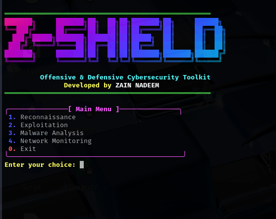
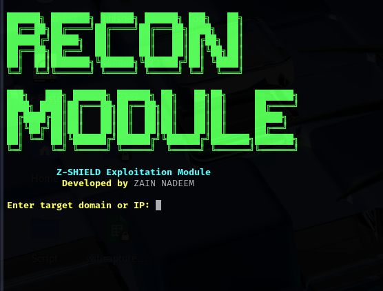
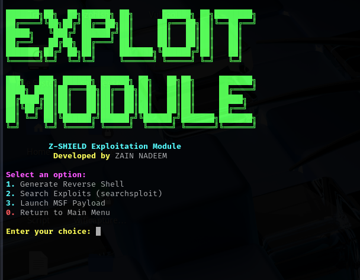
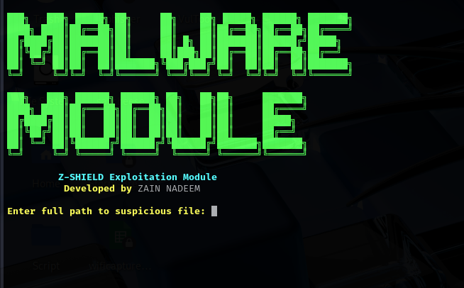

# Z-SHIELD 🔒
### Offensive Security & Penetration Testing Toolkit – Built for Kali Linux Professionals

Z-SHIELD is a high-performance, terminal-based cybersecurity assessment toolkit written in Bash. Built entirely on Kali Linux’s native tools, it automates reconnaissance, exploitation, malware analysis, and live network monitoring. Designed for penetration testers, red teamers, and ethical hackers seeking speed, clean output, and professional-grade functionality.

---

## 📌 Features

- 🎯 Fast & aggressive reconnaissance with clean tabular output
- ⚔️ Exploitation automation (Metasploit integration)
- 🧬 Malware scanning & suspicious file analysis
- 🌐 Live network monitoring and sniffing
- ✅ Clean UI, animated banner, and modular design
- 💡 Built for real-world offensive operations

---

### Z-SHIELD Main Menu




## 📁 Modules Overview

### 1️⃣ Reconnaissance & Information Gathering Tools
**Purpose:** Fast information gathering on target domains or IPs.

- Performs aggressive open-port scanning using `nmap`
- Detects DNS records using `dnsenum`
- Automatically detects WordPress sites with `wpscan`
- Shows all results in clean, color-coded tables directly in the terminal

📂 Tools Used: `nmap`, `dnsenum`, `wpscan`

```bash
╭──────────────────────────────────────────╮
│         Z-SHIELD Recon Module            │
╰──────────────────────────────────────────╯

+--------+------------------------+
| PORT   | STATE & SERVICE        |
+--------+------------------------+
| 80/tcp | open  http             |
| 443/tcp| open  https            |
+--------+------------------------+

+--------+------------------------+
| TYPE   | DATA                   |
+--------+------------------------+
| A      | 192.0.2.1              |
| MX     | mail.example.com       |
+--------+------------------------+
```
### Reconnaissance Module Output




2️⃣ Exploitation Module
Purpose: Launch Metasploit Framework with preset payload handling.

Automatically checks if msfconsole is installed

Prepares common handlers like reverse shells

Clean interactive menu

📂 Tools Used: msfconsole (Kali built-in)

```bash
╭──────────────────────────────────────────╮
│         Z-SHIELD Exploitation            │
╰──────────────────────────────────────────╯
```
### Exploitation Module Output




3️⃣ Malware Detection & Threat Analysis
Purpose: Scan directories for malware or suspicious files.

Scans user-specified folders using clamscan

Results shown in clean tables with color-coded threat indication

Fast scanning, CLI-friendly

📂 Tools Used: clamscan

```bash
╭──────────────────────────────────────────╮
│       Z-SHIELD Malware Analysis          │
╰──────────────────────────────────────────╯

+-------------------------+---------------+
| FILE                    | STATUS        |
+-------------------------+---------------+
| /home/user/infected.sh  | MALWARE FOUND |
+-------------------------+---------------+

```
### Malware Module Output




4️⃣ Live Network Monitoring & Packet Capture Tools
Purpose: Monitor traffic on a selected network interface.

Live packet capture using tcpdump

Interface selector included

Can also show real-time connection tracking

📂 Tools Used: tcpdump, netstat, iftop

```bash
╭──────────────────────────────────────────╮
│     Z-SHIELD Network Monitoring          │
╰──────────────────────────────────────────╯

```
### Network Module Output


🚀 Installation
Run the following commands on Kali Linux:

```bash
git clone https://github.com/zainnadeem786/zshield.git

cd zshield

chmod +x install.sh

sudo ./install.sh

Then run:
./zshield
```
```bash
✅ Requirements
Z-SHIELD requires Kali Linux with the following tools pre-installed (they are by default):


nmap
dnsenum
wpscan
tcpdump
clamscan
netstat
msfconsole (optional for exploitation)
```

⚠️ Disclaimer
Z-SHIELD is intended for educational and authorized penetration testing only. Unauthorized use against systems you don't own or have explicit permission to test is illegal and unethical.

👨‍💻 Developed By
ZAIN NADEEM
Cybersecurity Engineer | Python Developer | Ethical Hacker

Z-SHIELD is part of an ongoing professional offensive toolkit project developed and maintained by Zain Nadeem. Contributions, ideas, and forks are welcome.
Z-SHIELD leverages trusted tools like nmap, wpscan, and tcpdump to deliver real-time results directly in the terminal ideal for ethical hacking and penetration testing workflows.

## 📄 License

This project is licensed under the [MIT License](./LICENSE) .

## 🔍 Tags

`offensive-security` `penetration-testing` `ethical-hacking` `cybersecurity-tools` `terminal-tools` `kali-linux` `bash-scripts` `information-gathering` `reconnaissance-tools` `network-monitoring` `malware-analysis` `red-team` `cybersecurity-automation`
